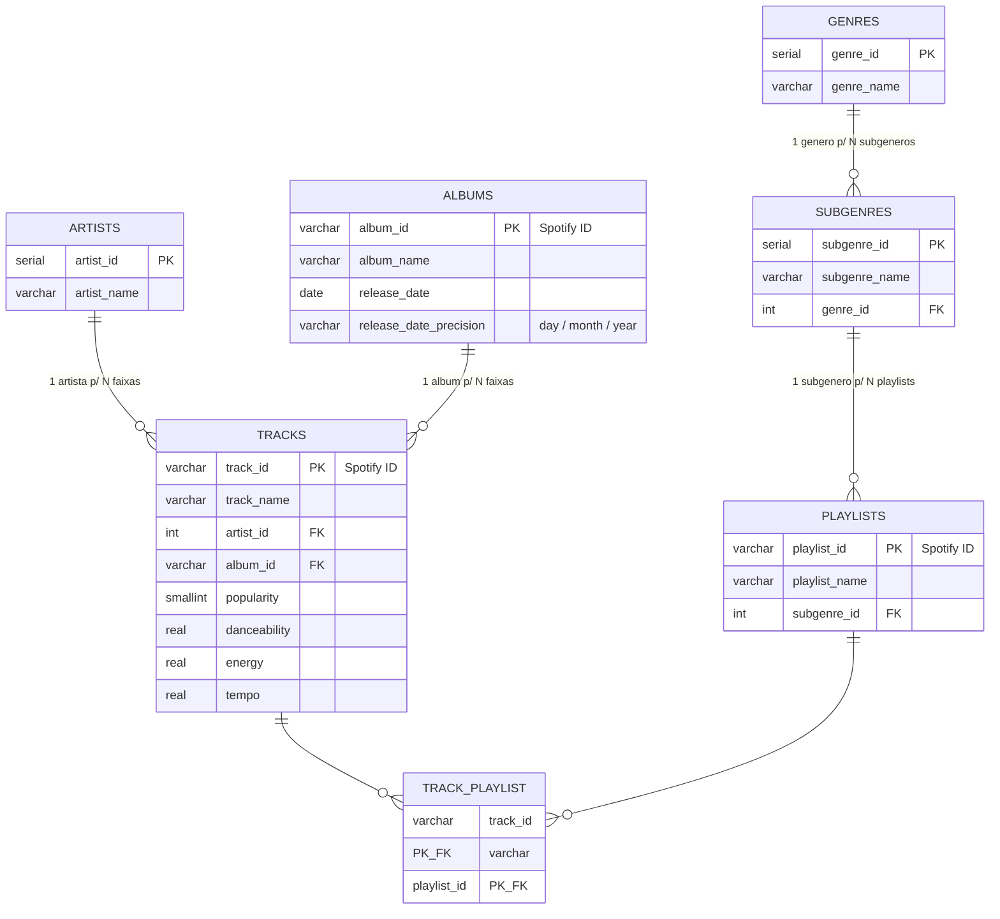

# beat-insights

Pipeline de dados sobre música eletrônica: ingestão em Python, PostgreSQL (Docker),
queries SQL analíticas (CTEs, window functions, índices) e dashboard no Looker Studio.
Projeto de portfólio ligado à minha atuação como DJ/produtor — as perguntas de negócio
giram em torno de tendências de gênero/subgênero de EDM, não só métricas genéricas de
streaming.

Contexto completo de decisão (por que este dataset, trade-offs descartados) em
[`docs/spec.md`](docs/spec.md).

## Como rodar do zero

Pré-requisitos: Docker, Python 3.12+, e o CSV do dataset baixado manualmente do Kaggle
([joebeachcapital/30000-spotify-songs](https://www.kaggle.com/datasets/joebeachcapital/30000-spotify-songs))
em `data/raw/spotify_songs.csv`.

```bash
# 1. credenciais locais do Postgres
cp .env.example .env

# 1.2 se já existir um volume de tentativa anterior:
docker compose down -v

# 2. sobe o Postgres (container beat-insights-db)
docker compose up -d

# 3. aplica o schema (7 tabelas, índices, comentários de catálogo)
docker exec -i beat-insights-db psql -U beat_insights -d beat_insights < sql/schema/001_create_tables.sql

# 4. ambiente Python e dependências
python3 -m venv .venv
.venv/bin/pip install -r requirements.txt

# 5. roda a ingestão (CSV -> 7 tabelas normalizadas)
.venv/bin/python src/ingest.py

# 6. confere as contagens
docker exec -i beat-insights-db psql -U beat_insights -d beat_insights -c "
SELECT 'genres' t, COUNT(*) FROM genres
UNION ALL SELECT 'subgenres', COUNT(*) FROM subgenres
UNION ALL SELECT 'artists', COUNT(*) FROM artists
UNION ALL SELECT 'albums', COUNT(*) FROM albums
UNION ALL SELECT 'tracks', COUNT(*) FROM tracks
UNION ALL SELECT 'playlists', COUNT(*) FROM playlists
UNION ALL SELECT 'track_playlist', COUNT(*) FROM track_playlist;
"
```

Contagens esperadas (dataset "30000 Spotify Songs", TidyTuesday): 6 genres, 24
subgenres, 10.692 artists, 22.543 albums, 28.352 tracks, 471 playlists, 32.246
track_playlist.

As queries analíticas ficam em `sql/queries/` (ver seção abaixo) e podem ser rodadas
com `docker exec -i beat-insights-db psql -U beat_insights -d beat_insights < sql/queries/01_top_tracks_por_subgenero.sql`,
substituindo o nome do arquivo.

## Schema



`track_playlist` existe porque a granularidade real do CSV bruto é (faixa, playlist):
a mesma faixa aparece várias vezes se está em playlists diferentes — sem essa tabela de
junção, `tracks` teria audio features duplicadas por linha.

## Decisões técnicas (resumo — detalhes e números completos em [`docs/spec.md`](docs/spec.md))

- **Chave natural vs. serial:** `tracks`, `albums` e `playlists` usam o próprio ID do
  Spotify como PK (já único e estável, sem motivo pra um serial redundante).
  `genres`, `subgenres` e `artists` usam serial, porque essas dimensões não têm ID
  nativo no CSV — só texto livre, sem garantia de estabilidade.
- **`track_artist` sem split multi-artista:** 854 linhas (2,6%) têm algum separador
  candidato (`,`, `;`, `feat.`, `&`, `with`), mas a inspeção manual mostrou que a
  maioria é falso positivo — o separador é parte do nome do ato (`Dimitri Vegas & Like
  Mike`, `Tyler, The Creator`). Só `feat.` é confiável (~11 linhas, 0,03%). Normalizar
  cobriria menos de 0,1% dos dados e exigiria uma lista de exceções curada à mão —
  desproporcional ao ganho.
- **`playlist_id → subgenre` resolvido por moda:** 8 de 471 playlists (1,7%) aparecem
  com mais de um `playlist_subgenre` no CSV bruto. A ingestão usa o subgênero mais
  frequente por playlist, com desempate pela primeira ocorrência no arquivo.
- **`albums.release_date_precision`:** o CSV tem 3 granularidades de data (dia
  completo 94,3%, ano-mês 0,09%, só ano 5,65%). Datas incompletas são preenchidas com
  dia/mês `01`, e essa coluna marca a granularidade original — sem ela, agregações
  mensais/trimestrais teriam viés artificial em janeiro sem indicar que é imputação.

## Queries analíticas (`sql/queries/`)

| Arquivo | Pergunta de negócio | Destaque técnico |
|---|---|---|
| `01_top_tracks_por_subgenero.sql` | Quais as faixas mais populares dentro de cada subgênero de EDM? | `DENSE_RANK() OVER (PARTITION BY ...)` |
| `02_variacao_anual_audio_features.sql` | Como energy/danceability médios evoluem ano a ano, por gênero? | `LAG() OVER (PARTITION BY ... ORDER BY ano)` |
| `03_media_movel_popularidade_trimestral.sql` | Qual a tendência de popularidade por trimestre, por gênero, suavizada? | `AVG() OVER` com frame de linhas (média móvel de 4 trimestres) |
| `04_artistas_recorrentes_subgeneros_edm.sql` | Quais artistas produzem consistentemente para múltiplos subgêneros de EDM? | 2 CTEs encadeadas (agregação → filtro → ranking) |
| `05_lancamentos_por_trimestre.sql` | Como o volume de lançamentos cresce trimestre a trimestre nos últimos anos? | `idx_albums_release_date` + `EXPLAIN ANALYZE` real (ver destaque abaixo) |
| `06_faixas_de_uma_playlist.sql` | Quais faixas pertencem a uma playlist específica? | `idx_track_playlist_playlist_id` + `EXPLAIN ANALYZE` real |
| `07_outliers_popularidade_por_subgenero.sql` | Quais faixas mais se desviam da popularidade média do seu subgênero (top 10)? | Desvio via `AVG() OVER (PARTITION BY ...)` |
| `08_sazonalidade_lancamentos_por_mes.sql` | Existe sazonalidade de lançamento por mês, por gênero? | Filtro `release_date_precision IN ('day','month')` |

### Destaque: índice existir ≠ índice ser usado

Na query 05, testei primeiro um filtro de data amplo (`release_date >= '2015-01-01'`,
~63% da tabela `albums`) — o Postgres **ignorou** `idx_albums_release_date` mesmo com
ele presente, e escolheu Seq Scan, porque o filtro não era seletivo o bastante para
compensar o custo do índice. Com um filtro mais estreito (`>= '2020-01-01'`, ~2,7% da
tabela), o plano muda para `Bitmap Index Scan` e o custo estimado do sub-plano cai de
563.14 para 242.77. Confirmei isso rodando `EXPLAIN ANALYZE` com o índice presente,
depois `DROP INDEX` + mesma query, depois recriando o índice — o comparativo completo
(planos reais, não teóricos) está documentado como comentário no final de
`sql/queries/05_lancamentos_por_trimestre.sql`. Na query 06
(`idx_track_playlist_playlist_id`), o ganho aparece também no tempo de execução real:
2,374ms sem o índice vs. 0,676ms com ele (~3,5x), porque ali o Postgres varre e
descarta 32.146 de 32.246 linhas sem o índice (`Rows Removed by Filter`).

## Dashboard

_Pendente — próxima etapa do projeto._
